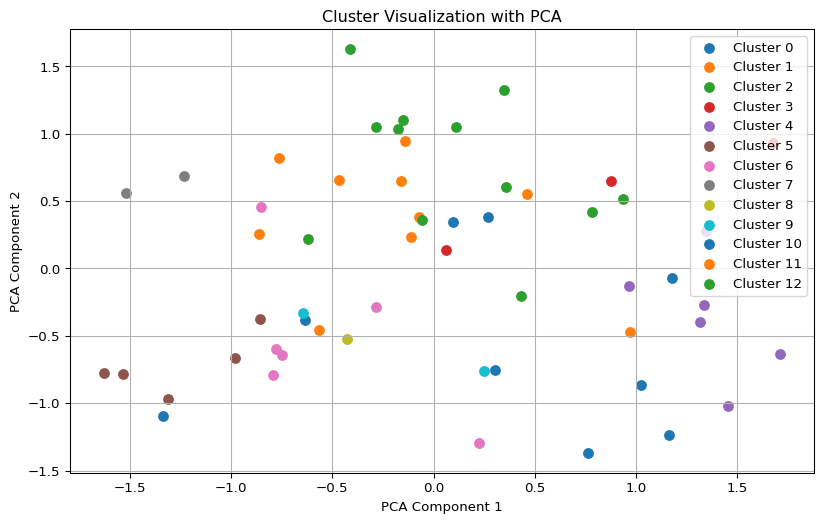

# Spike Interest-Based ML Matching

**Part 1: Profile Generation, Data Binarization, and Clustering**

``` python
import random
import numpy as np
import matplotlib.pyplot as plt
from sklearn.cluster import KMeans
from sklearn.preprocessing import MultiLabelBinarizer
from sklearn.decomposition import PCA
from scipy.stats import mode

# Attributes and their possible values with adjustments
age_ranges = ['18-25', '26-35', '36-45', '46-55', '56-65', '66+']
sports_activities = ['Skiing', 'Football', 'Jogging', 'Hiking', 'Swimming']
pets = ['cats', 'dogs']
types_of_lunch_discussion = ['casual', 'professional']
nationalities = ['German', 'Swiss', 'Austrian']
children_options = ['no_children', 'children']
hobbies = ['travel', 'music', 'art', 'healthy-living', 'mindfulness']

# Helper function to generate random profiles
def generate_profiles(num_profiles):
    profiles = []
    for i in range(num_profiles):
        profile = {
            'age_range': random.choice(age_ranges) if random.random() < 0.85 else None,
            'sports_activities': random.sample(sports_activities, random.randint(0, len(sports_activities))),
            'pets': random.choice(pets) if random.random() < 0.75 else None,
            'type_of_lunch_discussion': random.choice(types_of_lunch_discussion) if random.random() < 0.65 else None,
            'nationality': random.choice(nationalities) if random.random() < 0.55 else None,
            'children': 'children' if random.random() < 0.8 else 'no_children',
            'hobbies': random.sample(hobbies, random.randint(0, len(hobbies)))
        }
        profiles.append(profile)
    return profiles

# Helper function to binarize profile data
def binarize_profiles(profiles):
    mlb = MultiLabelBinarizer()
    binarized_data = []

    for profile in profiles:
        binarized_profile = np.array([], dtype=np.int32)
        for attribute, all_options in [
            ('age_range', age_ranges),
            ('sports_activities', sports_activities),
            ('pets', pets),
            ('type_of_lunch_discussion', types_of_lunch_discussion),
            ('nationality', nationalities),
            ('children', children_options)
        ]:
            profile_data = profile.get(attribute, [])
            if attribute == 'sports_activities' or attribute == 'hobbies':
                binarized_values = mlb.fit([all_options]).transform([profile_data]).flatten()
            elif profile_data:
                binarized_values = mlb.fit([all_options]).transform([[profile_data]]).flatten()
            else:
                binarized_values = np.zeros(len(all_options), dtype= int)
            binarized_profile = np.concatenate((binarized_profile, binarized_values))

        # Hobbies is a multi-label attribute
        hobby_values = profile.get('hobbies', [])
        binarized_hobby_values = mlb.fit([hobbies]).transform([hobby_values]).flatten()
        binarized_profile = np.concatenate((binarized_profile, binarized_hobby_values))

        binarized_data.append(binarized_profile)

    return np.array(binarized_data)

# Generate profiles
num_profiles = 56
profiles = generate_profiles(num_profiles)
```

**Part 2: Perform Clustering, Visualization, and Analysis of Common
Interests**

``` python
# Custom clustering with a limit on the number of iterations to prevent infinite loops
def custom_clustering(data, min_size, max_size, max_iterations=10):
    num_clusters = max(len(data) // ((min_size + max_size) // 2), 1)
    labels = KMeans(n_clusters=num_clusters, random_state=42).fit_predict(data)
    
    iteration = 0
    while iteration < max_iterations:
        iteration += 1
        unique, counts = np.unique(labels, return_counts=True)
        if all(min_size <= count <= max_size for count in counts):
            break
        if any(count > max_size for count in counts):
            num_clusters += 1
        elif any(count < min_size for count in counts):
            num_clusters = max(1, num_clusters - 1)
        labels = KMeans(n_clusters=num_clusters, random_state=42).fit_predict(data)
        
    return labels

# Binarize the profile data
binarized_profiles = binarize_profiles(profiles)

# Perform custom clustering with group size constraints
labels = custom_clustering(binarized_profiles, min_size=3, max_size=8)

# Visualize the clusters using PCA
pca = PCA(n_components=2)
transformed_data = pca.fit_transform(binarized_profiles)

# Group profiles by cluster and calculate common interests
clustered_profiles = {i: [] for i in range(max(labels) + 1)}

for index, label in enumerate(labels):
    clustered_profiles[label].append(profiles[index])

def visualize_clusters(transformed_data, labels):
    unique_labels = np.unique(labels)
    plt.figure(figsize=(10, 6))
    for cluster_id in unique_labels:
        cluster_data = transformed_data[labels == cluster_id]
        plt.scatter(cluster_data[:, 0], cluster_data[:, 1], label=f'Cluster {cluster_id}', s=50)
    plt.title('Cluster Visualization with PCA')
    plt.legend()
    plt.xlabel('PCA Component 1')
    plt.ylabel('PCA Component 2')
    plt.grid(True)
    plt.show()

visualize_clusters(transformed_data, labels)

# Calculate and display common interest for each cluster
for cluster_id, cluster_profiles in clustered_profiles.items():
    if not cluster_profiles:  # Skip empty clusters
        continue
    
    cluster_binarized = binarize_profiles(cluster_profiles)
    common_interests_binary = mode(cluster_binarized, axis=0).mode[0]
    
    # Decode common interests from binary to human-readable format
    common_interests = {
        # Initialize common interests as None or empty list based on single/multi-label
        'age_range': None, 
        'sports_activities': [],
        'pets': None,
        'type_of_lunch_discussion': None,
        'nationality': None,
        'children': None,
        'hobbies': [],
    }
    
    index_offset = 0
    for attribute, all_options in [
        ('age_range', age_ranges),
        ('sports_activities', sports_activities),
        ('pets', pets),
        ('type_of_lunch_discussion', types_of_lunch_discussion),
        ('nationality', nationalities),
        ('children', children_options),
        ('hobbies', hobbies)
    ]:
        if attribute in ['sports_activities', 'hobbies']:
            for i, option in enumerate(all_options):
                if common_interests_binary[index_offset + i] == 1:
                    common_interests[attribute].append(option)
        else:
            options_indices = np.where(common_interests_binary[index_offset:index_offset + len(all_options)])[0]
            if options_indices.size > 0:
                common_interests[attribute] = all_options[options_indices[0]]
        index_offset += len(all_options)

    print(f"\nCluster {cluster_id} (Size: {len(cluster_profiles)}):")
    for profile in cluster_profiles:
        print(profile)
    print(f"Common Interests: {common_interests}\n")
```

    /Users/gordonkoehn/opt/anaconda3/envs/baselhack/lib/python3.9/site-packages/sklearn/cluster/_kmeans.py:1416: FutureWarning: The default value of `n_init` will change from 10 to 'auto' in 1.4. Set the value of `n_init` explicitly to suppress the warning
      super()._check_params_vs_input(X, default_n_init=10)
    /Users/gordonkoehn/opt/anaconda3/envs/baselhack/lib/python3.9/site-packages/sklearn/cluster/_kmeans.py:1416: FutureWarning: The default value of `n_init` will change from 10 to 'auto' in 1.4. Set the value of `n_init` explicitly to suppress the warning
      super()._check_params_vs_input(X, default_n_init=10)
    /Users/gordonkoehn/opt/anaconda3/envs/baselhack/lib/python3.9/site-packages/sklearn/cluster/_kmeans.py:1416: FutureWarning: The default value of `n_init` will change from 10 to 'auto' in 1.4. Set the value of `n_init` explicitly to suppress the warning
      super()._check_params_vs_input(X, default_n_init=10)
    /Users/gordonkoehn/opt/anaconda3/envs/baselhack/lib/python3.9/site-packages/sklearn/cluster/_kmeans.py:1416: FutureWarning: The default value of `n_init` will change from 10 to 'auto' in 1.4. Set the value of `n_init` explicitly to suppress the warning
      super()._check_params_vs_input(X, default_n_init=10)
    /Users/gordonkoehn/opt/anaconda3/envs/baselhack/lib/python3.9/site-packages/sklearn/cluster/_kmeans.py:1416: FutureWarning: The default value of `n_init` will change from 10 to 'auto' in 1.4. Set the value of `n_init` explicitly to suppress the warning
      super()._check_params_vs_input(X, default_n_init=10)
    /Users/gordonkoehn/opt/anaconda3/envs/baselhack/lib/python3.9/site-packages/sklearn/cluster/_kmeans.py:1416: FutureWarning: The default value of `n_init` will change from 10 to 'auto' in 1.4. Set the value of `n_init` explicitly to suppress the warning
      super()._check_params_vs_input(X, default_n_init=10)
    /Users/gordonkoehn/opt/anaconda3/envs/baselhack/lib/python3.9/site-packages/sklearn/cluster/_kmeans.py:1416: FutureWarning: The default value of `n_init` will change from 10 to 'auto' in 1.4. Set the value of `n_init` explicitly to suppress the warning
      super()._check_params_vs_input(X, default_n_init=10)
    /Users/gordonkoehn/opt/anaconda3/envs/baselhack/lib/python3.9/site-packages/sklearn/cluster/_kmeans.py:1416: FutureWarning: The default value of `n_init` will change from 10 to 'auto' in 1.4. Set the value of `n_init` explicitly to suppress the warning
      super()._check_params_vs_input(X, default_n_init=10)
    /Users/gordonkoehn/opt/anaconda3/envs/baselhack/lib/python3.9/site-packages/sklearn/cluster/_kmeans.py:1416: FutureWarning: The default value of `n_init` will change from 10 to 'auto' in 1.4. Set the value of `n_init` explicitly to suppress the warning
      super()._check_params_vs_input(X, default_n_init=10)
    /Users/gordonkoehn/opt/anaconda3/envs/baselhack/lib/python3.9/site-packages/sklearn/cluster/_kmeans.py:1416: FutureWarning: The default value of `n_init` will change from 10 to 'auto' in 1.4. Set the value of `n_init` explicitly to suppress the warning
      super()._check_params_vs_input(X, default_n_init=10)
    /Users/gordonkoehn/opt/anaconda3/envs/baselhack/lib/python3.9/site-packages/sklearn/cluster/_kmeans.py:1416: FutureWarning: The default value of `n_init` will change from 10 to 'auto' in 1.4. Set the value of `n_init` explicitly to suppress the warning
      super()._check_params_vs_input(X, default_n_init=10)




    Cluster 0 (Size: 4):
    {'age_range': '56-65', 'sports_activities': [], 'pets': 'dogs', 'type_of_lunch_discussion': 'professional', 'nationality': 'Austrian', 'children': 'no_children', 'hobbies': ['music', 'healthy-living', 'travel', 'mindfulness']}
    {'age_range': None, 'sports_activities': ['Swimming', 'Football'], 'pets': 'dogs', 'type_of_lunch_discussion': None, 'nationality': 'Austrian', 'children': 'no_children', 'hobbies': ['healthy-living', 'travel', 'music', 'art']}
    {'age_range': '56-65', 'sports_activities': ['Football', 'Swimming', 'Skiing', 'Jogging', 'Hiking'], 'pets': None, 'type_of_lunch_discussion': None, 'nationality': 'Austrian', 'children': 'no_children', 'hobbies': ['music', 'art', 'healthy-living', 'travel', 'mindfulness']}
    {'age_range': '66+', 'sports_activities': ['Football', 'Skiing', 'Jogging', 'Swimming'], 'pets': None, 'type_of_lunch_discussion': None, 'nationality': 'Austrian', 'children': 'children', 'hobbies': ['healthy-living', 'travel', 'art', 'music']}
    Common Interests: {'age_range': None, 'sports_activities': ['Skiing', 'Swimming'], 'pets': None, 'type_of_lunch_discussion': None, 'nationality': 'German', 'children': 'children', 'hobbies': ['travel', 'music', 'healthy-living', 'mindfulness']}


    Cluster 1 (Size: 8):
    {'age_range': '26-35', 'sports_activities': [], 'pets': 'cats', 'type_of_lunch_discussion': None, 'nationality': 'Austrian', 'children': 'children', 'hobbies': ['healthy-living', 'travel', 'music']}
    {'age_range': '36-45', 'sports_activities': ['Skiing'], 'pets': 'cats', 'type_of_lunch_discussion': 'casual', 'nationality': 'Swiss', 'children': 'children', 'hobbies': ['travel', 'healthy-living']}
    {'age_range': '26-35', 'sports_activities': ['Hiking'], 'pets': 'cats', 'type_of_lunch_discussion': 'casual', 'nationality': None, 'children': 'children', 'hobbies': ['art', 'travel']}
    {'age_range': None, 'sports_activities': [], 'pets': 'cats', 'type_of_lunch_discussion': 'casual', 'nationality': None, 'children': 'children', 'hobbies': ['travel', 'art', 'healthy-living']}
    {'age_range': '26-35', 'sports_activities': ['Hiking'], 'pets': 'dogs', 'type_of_lunch_discussion': None, 'nationality': None, 'children': 'children', 'hobbies': ['travel', 'healthy-living', 'art']}
    {'age_range': None, 'sports_activities': ['Football'], 'pets': None, 'type_of_lunch_discussion': 'casual', 'nationality': 'Swiss', 'children': 'children', 'hobbies': ['healthy-living', 'art']}
    {'age_range': '36-45', 'sports_activities': ['Skiing', 'Swimming'], 'pets': 'dogs', 'type_of_lunch_discussion': 'casual', 'nationality': 'Swiss', 'children': 'children', 'hobbies': ['art', 'mindfulness', 'healthy-living']}
    {'age_range': None, 'sports_activities': [], 'pets': 'cats', 'type_of_lunch_discussion': 'casual', 'nationality': None, 'children': 'children', 'hobbies': ['healthy-living', 'art']}
    Common Interests: {'age_range': None, 'sports_activities': [], 'pets': 'cats', 'type_of_lunch_discussion': 'casual', 'nationality': None, 'children': 'no_children', 'hobbies': ['travel', 'music', 'mindfulness']}


    Cluster 2 (Size: 10):
    {'age_range': '18-25', 'sports_activities': ['Jogging', 'Football', 'Skiing', 'Hiking', 'Swimming'], 'pets': 'dogs', 'type_of_lunch_discussion': None, 'nationality': 'German', 'children': 'children', 'hobbies': ['healthy-living', 'music', 'mindfulness', 'art']}
    {'age_range': '56-65', 'sports_activities': ['Hiking', 'Skiing', 'Swimming', 'Football'], 'pets': 'cats', 'type_of_lunch_discussion': None, 'nationality': None, 'children': 'children', 'hobbies': ['music', 'art', 'mindfulness', 'healthy-living']}
    {'age_range': '36-45', 'sports_activities': ['Skiing', 'Hiking', 'Swimming', 'Football', 'Jogging'], 'pets': 'cats', 'type_of_lunch_discussion': 'professional', 'nationality': None, 'children': 'children', 'hobbies': ['music', 'healthy-living']}
    {'age_range': None, 'sports_activities': ['Hiking', 'Swimming', 'Jogging', 'Skiing'], 'pets': 'cats', 'type_of_lunch_discussion': None, 'nationality': None, 'children': 'children', 'hobbies': ['healthy-living', 'music', 'mindfulness', 'art', 'travel']}
    {'age_range': '46-55', 'sports_activities': ['Skiing', 'Football', 'Swimming'], 'pets': 'cats', 'type_of_lunch_discussion': None, 'nationality': 'German', 'children': 'children', 'hobbies': ['art', 'travel', 'healthy-living', 'music']}
    {'age_range': None, 'sports_activities': ['Skiing', 'Swimming', 'Jogging'], 'pets': 'cats', 'type_of_lunch_discussion': None, 'nationality': 'Austrian', 'children': 'children', 'hobbies': ['art']}
    {'age_range': '18-25', 'sports_activities': ['Skiing', 'Hiking', 'Swimming', 'Football'], 'pets': 'cats', 'type_of_lunch_discussion': 'casual', 'nationality': 'Austrian', 'children': 'children', 'hobbies': ['travel', 'art', 'mindfulness', 'healthy-living']}
    {'age_range': '46-55', 'sports_activities': ['Football', 'Swimming', 'Hiking'], 'pets': 'cats', 'type_of_lunch_discussion': 'casual', 'nationality': None, 'children': 'children', 'hobbies': ['healthy-living', 'travel', 'mindfulness', 'music']}
    {'age_range': '56-65', 'sports_activities': ['Skiing', 'Swimming', 'Jogging'], 'pets': 'cats', 'type_of_lunch_discussion': None, 'nationality': None, 'children': 'children', 'hobbies': ['art', 'music']}
    {'age_range': '18-25', 'sports_activities': ['Hiking', 'Skiing', 'Swimming'], 'pets': 'cats', 'type_of_lunch_discussion': 'casual', 'nationality': 'Swiss', 'children': 'children', 'hobbies': ['art', 'travel', 'music', 'healthy-living', 'mindfulness']}
    Common Interests: {'age_range': None, 'sports_activities': ['Skiing', 'Football', 'Hiking', 'Swimming'], 'pets': 'cats', 'type_of_lunch_discussion': None, 'nationality': None, 'children': 'no_children', 'hobbies': ['travel', 'music', 'art', 'healthy-living']}


    Cluster 3 (Size: 3):
    {'age_range': '56-65', 'sports_activities': ['Football', 'Hiking', 'Skiing', 'Swimming', 'Jogging'], 'pets': 'cats', 'type_of_lunch_discussion': 'casual', 'nationality': 'Swiss', 'children': 'children', 'hobbies': []}
    {'age_range': None, 'sports_activities': ['Swimming', 'Hiking', 'Football', 'Jogging', 'Skiing'], 'pets': None, 'type_of_lunch_discussion': 'casual', 'nationality': 'Swiss', 'children': 'children', 'hobbies': ['travel', 'music', 'mindfulness']}
    {'age_range': '36-45', 'sports_activities': ['Swimming', 'Jogging', 'Hiking', 'Football'], 'pets': None, 'type_of_lunch_discussion': 'professional', 'nationality': 'Swiss', 'children': 'children', 'hobbies': ['healthy-living', 'music', 'mindfulness', 'travel']}
    Common Interests: {'age_range': None, 'sports_activities': ['Skiing', 'Football', 'Jogging', 'Hiking', 'Swimming'], 'pets': None, 'type_of_lunch_discussion': 'casual', 'nationality': 'Austrian', 'children': 'no_children', 'hobbies': ['art', 'healthy-living', 'mindfulness']}


    Cluster 4 (Size: 6):
    {'age_range': '66+', 'sports_activities': ['Skiing', 'Football', 'Jogging', 'Hiking'], 'pets': 'dogs', 'type_of_lunch_discussion': 'casual', 'nationality': 'Swiss', 'children': 'children', 'hobbies': ['travel', 'art']}
    {'age_range': '26-35', 'sports_activities': ['Hiking', 'Jogging', 'Skiing', 'Football'], 'pets': 'dogs', 'type_of_lunch_discussion': None, 'nationality': 'Austrian', 'children': 'children', 'hobbies': []}
    {'age_range': '36-45', 'sports_activities': ['Swimming', 'Hiking', 'Skiing', 'Football', 'Jogging'], 'pets': None, 'type_of_lunch_discussion': None, 'nationality': None, 'children': 'no_children', 'hobbies': ['mindfulness']}
    {'age_range': '66+', 'sports_activities': ['Swimming', 'Hiking', 'Skiing', 'Football'], 'pets': None, 'type_of_lunch_discussion': 'casual', 'nationality': 'German', 'children': 'children', 'hobbies': []}
    {'age_range': '66+', 'sports_activities': ['Swimming', 'Hiking', 'Football', 'Jogging', 'Skiing'], 'pets': 'dogs', 'type_of_lunch_discussion': None, 'nationality': None, 'children': 'children', 'hobbies': []}
    {'age_range': '26-35', 'sports_activities': ['Football', 'Swimming', 'Hiking', 'Skiing', 'Jogging'], 'pets': 'dogs', 'type_of_lunch_discussion': None, 'nationality': None, 'children': 'children', 'hobbies': ['healthy-living']}
    Common Interests: {'age_range': None, 'sports_activities': ['Skiing', 'Football', 'Jogging', 'Hiking', 'Swimming'], 'pets': 'dogs', 'type_of_lunch_discussion': None, 'nationality': None, 'children': 'no_children', 'hobbies': []}


    Cluster 5 (Size: 5):
    {'age_range': '66+', 'sports_activities': [], 'pets': 'dogs', 'type_of_lunch_discussion': 'professional', 'nationality': 'German', 'children': 'children', 'hobbies': ['art', 'healthy-living', 'music', 'travel', 'mindfulness']}
    {'age_range': '36-45', 'sports_activities': [], 'pets': 'dogs', 'type_of_lunch_discussion': 'professional', 'nationality': 'German', 'children': 'children', 'hobbies': ['healthy-living', 'mindfulness', 'music', 'travel']}
    {'age_range': '36-45', 'sports_activities': [], 'pets': 'dogs', 'type_of_lunch_discussion': None, 'nationality': 'German', 'children': 'no_children', 'hobbies': ['art', 'healthy-living', 'music', 'travel', 'mindfulness']}
    {'age_range': '56-65', 'sports_activities': ['Skiing'], 'pets': 'dogs', 'type_of_lunch_discussion': 'professional', 'nationality': 'German', 'children': 'children', 'hobbies': ['music', 'art', 'healthy-living', 'mindfulness']}
    {'age_range': None, 'sports_activities': [], 'pets': None, 'type_of_lunch_discussion': None, 'nationality': 'German', 'children': 'children', 'hobbies': ['art', 'music', 'mindfulness']}
    Common Interests: {'age_range': None, 'sports_activities': [], 'pets': 'dogs', 'type_of_lunch_discussion': 'professional', 'nationality': 'Swiss', 'children': 'no_children', 'hobbies': ['travel', 'music', 'art', 'healthy-living', 'mindfulness']}


    Cluster 6 (Size: 6):
    {'age_range': '26-35', 'sports_activities': ['Hiking', 'Jogging'], 'pets': 'dogs', 'type_of_lunch_discussion': None, 'nationality': 'Austrian', 'children': 'children', 'hobbies': ['travel', 'healthy-living', 'art', 'music', 'mindfulness']}
    {'age_range': '26-35', 'sports_activities': ['Swimming', 'Jogging'], 'pets': None, 'type_of_lunch_discussion': 'casual', 'nationality': 'German', 'children': 'children', 'hobbies': ['travel', 'healthy-living', 'art', 'music', 'mindfulness']}
    {'age_range': None, 'sports_activities': ['Jogging'], 'pets': 'dogs', 'type_of_lunch_discussion': None, 'nationality': None, 'children': 'children', 'hobbies': ['music', 'travel', 'mindfulness', 'healthy-living']}
    {'age_range': None, 'sports_activities': ['Hiking', 'Jogging', 'Swimming'], 'pets': 'dogs', 'type_of_lunch_discussion': 'professional', 'nationality': 'Swiss', 'children': 'children', 'hobbies': ['mindfulness', 'art', 'travel', 'healthy-living']}
    {'age_range': '66+', 'sports_activities': ['Jogging'], 'pets': 'dogs', 'type_of_lunch_discussion': None, 'nationality': None, 'children': 'children', 'hobbies': ['mindfulness']}
    {'age_range': '46-55', 'sports_activities': ['Hiking'], 'pets': 'dogs', 'type_of_lunch_discussion': None, 'nationality': None, 'children': 'children', 'hobbies': ['mindfulness', 'travel', 'music', 'art']}
    Common Interests: {'age_range': None, 'sports_activities': ['Jogging'], 'pets': 'dogs', 'type_of_lunch_discussion': None, 'nationality': None, 'children': 'no_children', 'hobbies': ['travel', 'music', 'art', 'healthy-living', 'mindfulness']}


    Cluster 7 (Size: 2):
    {'age_range': '56-65', 'sports_activities': [], 'pets': 'cats', 'type_of_lunch_discussion': 'professional', 'nationality': 'Swiss', 'children': 'children', 'hobbies': ['art', 'healthy-living', 'travel', 'mindfulness', 'music']}
    {'age_range': None, 'sports_activities': ['Swimming'], 'pets': 'cats', 'type_of_lunch_discussion': 'professional', 'nationality': None, 'children': 'children', 'hobbies': ['music', 'healthy-living', 'art', 'mindfulness', 'travel']}
    Common Interests: {'age_range': None, 'sports_activities': [], 'pets': 'cats', 'type_of_lunch_discussion': 'professional', 'nationality': None, 'children': 'no_children', 'hobbies': ['travel', 'music', 'art', 'healthy-living', 'mindfulness']}


    Cluster 8 (Size: 1):
    {'age_range': '18-25', 'sports_activities': ['Skiing'], 'pets': 'dogs', 'type_of_lunch_discussion': 'casual', 'nationality': None, 'children': 'no_children', 'hobbies': ['mindfulness', 'music', 'art']}
    Common Interests: {'age_range': '18-25', 'sports_activities': ['Hiking'], 'pets': 'dogs', 'type_of_lunch_discussion': 'casual', 'nationality': None, 'children': 'children', 'hobbies': ['travel', 'art', 'healthy-living']}


    Cluster 9 (Size: 2):
    {'age_range': '56-65', 'sports_activities': ['Swimming'], 'pets': 'dogs', 'type_of_lunch_discussion': None, 'nationality': None, 'children': 'children', 'hobbies': []}
    {'age_range': '56-65', 'sports_activities': ['Hiking'], 'pets': 'dogs', 'type_of_lunch_discussion': None, 'nationality': 'Swiss', 'children': 'children', 'hobbies': ['healthy-living', 'art', 'music']}
    Common Interests: {'age_range': '56-65', 'sports_activities': [], 'pets': 'dogs', 'type_of_lunch_discussion': None, 'nationality': None, 'children': 'no_children', 'hobbies': []}


    Cluster 10 (Size: 5):
    {'age_range': '18-25', 'sports_activities': ['Football', 'Jogging'], 'pets': 'dogs', 'type_of_lunch_discussion': 'casual', 'nationality': 'Austrian', 'children': 'children', 'hobbies': ['travel', 'music']}
    {'age_range': '18-25', 'sports_activities': ['Hiking', 'Jogging', 'Skiing', 'Football'], 'pets': 'cats', 'type_of_lunch_discussion': 'professional', 'nationality': None, 'children': 'children', 'hobbies': ['mindfulness']}
    {'age_range': '46-55', 'sports_activities': ['Swimming', 'Football', 'Jogging', 'Hiking'], 'pets': 'dogs', 'type_of_lunch_discussion': 'professional', 'nationality': 'Austrian', 'children': 'children', 'hobbies': ['art']}
    {'age_range': '18-25', 'sports_activities': ['Football', 'Jogging'], 'pets': 'dogs', 'type_of_lunch_discussion': 'professional', 'nationality': None, 'children': 'children', 'hobbies': []}
    {'age_range': '36-45', 'sports_activities': ['Skiing', 'Hiking', 'Jogging', 'Football'], 'pets': 'dogs', 'type_of_lunch_discussion': 'professional', 'nationality': 'Austrian', 'children': 'children', 'hobbies': ['mindfulness']}
    Common Interests: {'age_range': '18-25', 'sports_activities': ['Skiing', 'Football', 'Jogging'], 'pets': 'dogs', 'type_of_lunch_discussion': 'professional', 'nationality': 'German', 'children': 'no_children', 'hobbies': []}


    Cluster 11 (Size: 2):
    {'age_range': '46-55', 'sports_activities': ['Jogging', 'Swimming', 'Skiing'], 'pets': 'dogs', 'type_of_lunch_discussion': 'casual', 'nationality': 'German', 'children': 'children', 'hobbies': []}
    {'age_range': None, 'sports_activities': ['Skiing', 'Jogging', 'Swimming'], 'pets': None, 'type_of_lunch_discussion': 'casual', 'nationality': None, 'children': 'children', 'hobbies': ['travel', 'healthy-living']}
    Common Interests: {'age_range': None, 'sports_activities': ['Jogging', 'Hiking', 'Swimming'], 'pets': None, 'type_of_lunch_discussion': 'casual', 'nationality': None, 'children': 'no_children', 'hobbies': []}


    Cluster 12 (Size: 2):
    {'age_range': '66+', 'sports_activities': ['Swimming', 'Jogging', 'Hiking'], 'pets': None, 'type_of_lunch_discussion': 'casual', 'nationality': 'Austrian', 'children': 'children', 'hobbies': ['music', 'mindfulness', 'art', 'healthy-living']}
    {'age_range': '66+', 'sports_activities': ['Jogging'], 'pets': None, 'type_of_lunch_discussion': 'casual', 'nationality': 'Swiss', 'children': 'children', 'hobbies': ['music', 'art', 'mindfulness', 'healthy-living']}
    Common Interests: {'age_range': '66+', 'sports_activities': ['Jogging'], 'pets': None, 'type_of_lunch_discussion': 'casual', 'nationality': None, 'children': 'no_children', 'hobbies': ['travel', 'music', 'art', 'healthy-living']}

This script: - Ensures that the `KMeans` clustering has at least one
cluster. - Uses PCA to visualize the clusters. - Calculates the most
common attributes for each cluster and prints the profiles.

Be sure to join both parts of the code in the same Python script and run
them together. This will create and display clusters with the specified
constraints, visualize the results, and output common interests for each
cluster. Make sure you have the necessary libraries (`numpy`,
`matplotlib`, `scikit-learn`) installed in your Python environment
before running the script.
