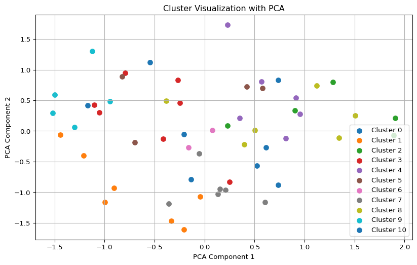

# Spike Interest-Based ML Matching

Let’s try to get the interest based matching to work. Here I am trying
to make a proof-of-concept to do the simplest form to make a
machine-learning based matching of users based on interest. I am just
curious how hard / easy it would have been to do.

**The below code was generated with Chat-GPT4-1106-preview - was not
checked for statitical correctnes. Some parts in the binarization I
don’t understand. K-means is obvisously a very simple and flawed
method. - Nevertheless, I am pretty impressed by this code.**

## Constraints

no person has lunch alone, group size larger than 2 no groups larger
than 10, won’t find a table people with similar interest are clustered
together most shared interests should be returned

## Data

Try to cluster people based on their age and interest, perhaps even
suggesting some shared topics. The raw data is just a series of binary
selections. All fields are optional. Here are some of the fields, but
not exclusive to:

- age-range: 18-25, 26-35, 36-45…
- sports activities: Skiing, Football, Jogging, Hiking, Swimming
- pets: cats, dogs
- type of lunch discussion: casual, professional
- nationality: German, Swiss, Austrian…
- children: yes, no
- hobbies: travel, music, art, healthy-living, mindfulness..

So the data will come in a dictionary, with booleans for each item.

### Bias

We implement an age based bias:

- Older individuals (grouped in the second half) are more likely to have
  children and prefer professional discussions.
- Younger individuals (grouped in the first half) are less likely to
  have children and prefer casual discussions.

The `bias_strength` parameter controls how strong the bias is. A larger
value means that the assigned attribute (`'yes'` for children and
`'professional'` for lunch discussion type) is more likely to be chosen
for older age groups.

The `assign_age` function is now biased so that the first half of the
generated people are more likely to be in the ‘18-25’ age range, while
the second half is more likely to be in the ‘66+’ age group. This
division helps create a clearer separation to demonstrate how the bias
works.

The generated data now reflects these biases and can be used for
clustering with the expectation that older people will often be grouped
based on their preference for professional discussions and the presence
of children.

## Description of the Code’s Functionality:

1.  **Profile Generation**: The code starts by generating a set of
    synthetic user profiles for a hypothetical lunch date randomizer
    app. This step randomly assigns attributes to each profile, such as
    age range, sports activities, and hobbies. There is also a provision
    for missing data to simulate optional fields.

2.  **Data Binarization**: Because many machine learning algorithms,
    including K-Means clustering, require numerical input, the
    categorical data for each user profile is binarized. This transforms
    the data into a format where each category and its possible values
    are represented by binary vectors (0s and 1s).

3.  **Clustering**: The K-Means clustering algorithm is then applied to
    group user profiles into clusters based on their similarity. A
    custom clustering function enforces minimum and maximum cluster size
    constraints by adjusting the number of clusters.

4.  **Cluster Visualization**: The code uses Principal Component
    Analysis (PCA) to reduce the high-dimensional binarized data to two
    dimensions, which is then visualized in a scatter plot. Each point
    represents a profile, and points are colored according to their
    cluster assignment.

5.  **Cluster Analysis**: After clustering, the code computes the most
    common attributes in each cluster to identify shared interests or
    features within the group.

# Code

This script:

- Ensures that the `KMeans` clustering has at least one cluster.
- Uses PCA to visualize the clusters.
- Calculates the most common attributes for each cluster and prints the
  profiles.

### Part 1: Profile Generation, Data Binarization, and Clustering

``` python
import random
import numpy as np
import matplotlib.pyplot as plt
from sklearn.cluster import KMeans
from sklearn.preprocessing import MultiLabelBinarizer
from sklearn.decomposition import PCA
from scipy.stats import mode

# Attributes and their possible values with adjustments
age_ranges = ['18-25', '26-35', '36-45', '46-55', '56-65', '66+']
sports_activities = ['Skiing', 'Football', 'Jogging', 'Hiking', 'Swimming']
pets = ['cats', 'dogs']
types_of_lunch_discussion = ['casual', 'professional']
nationalities = ['German', 'Swiss', 'Austrian']
children_options = ['no_children', 'children']
hobbies = ['travel', 'music', 'art', 'healthy-living', 'mindfulness']

# Helper function to generate random profiles
def generate_profiles(num_profiles):
    profiles = []
    for i in range(num_profiles):
        profile = {
            'age_range': random.choice(age_ranges) if random.random() < 0.85 else None,
            'sports_activities': random.sample(sports_activities, random.randint(0, len(sports_activities))),
            'pets': random.choice(pets) if random.random() < 0.75 else None,
            'type_of_lunch_discussion': random.choice(types_of_lunch_discussion) if random.random() < 0.65 else None,
            'nationality': random.choice(nationalities) if random.random() < 0.55 else None,
            'children': 'children' if random.random() < 0.8 else 'no_children',
            'hobbies': random.sample(hobbies, random.randint(0, len(hobbies)))
        }
        profiles.append(profile)
    return profiles

# Helper function to binarize profile data
def binarize_profiles(profiles):
    mlb = MultiLabelBinarizer()
    binarized_data = []

    for profile in profiles:
        binarized_profile = np.array([], dtype=np.int32)
        for attribute, all_options in [
            ('age_range', age_ranges),
            ('sports_activities', sports_activities),
            ('pets', pets),
            ('type_of_lunch_discussion', types_of_lunch_discussion),
            ('nationality', nationalities),
            ('children', children_options)
        ]:
            profile_data = profile.get(attribute, [])
            if attribute == 'sports_activities' or attribute == 'hobbies':
                binarized_values = mlb.fit([all_options]).transform([profile_data]).flatten()
            elif profile_data:
                binarized_values = mlb.fit([all_options]).transform([[profile_data]]).flatten()
            else:
                binarized_values = np.zeros(len(all_options), dtype= int)
            binarized_profile = np.concatenate((binarized_profile, binarized_values))

        # Hobbies is a multi-label attribute
        hobby_values = profile.get('hobbies', [])
        binarized_hobby_values = mlb.fit([hobbies]).transform([hobby_values]).flatten()
        binarized_profile = np.concatenate((binarized_profile, binarized_hobby_values))

        binarized_data.append(binarized_profile)

    return np.array(binarized_data)

# Generate profiles
num_profiles = 56
profiles = generate_profiles(num_profiles)
```

### Part 2: Perform Clustering, Visualization, and Analysis of Common Interests

``` python
# Custom clustering with a limit on the number of iterations to prevent infinite loops
def custom_clustering(data, min_size, max_size, max_iterations=30):
    num_clusters = max(len(data) // ((min_size + max_size) // 2), 1)
    labels = KMeans(n_clusters=num_clusters, random_state=42).fit_predict(data)
    
    iteration = 0
    while iteration < max_iterations:
        iteration += 1
        unique, counts = np.unique(labels, return_counts=True)
        if all(min_size <= count <= max_size for count in counts):
            break
        if any(count > max_size for count in counts):
            num_clusters += 1
        elif any(count < min_size for count in counts):
            num_clusters = max(1, num_clusters - 1)
        labels = KMeans(n_clusters=num_clusters, random_state=42).fit_predict(data)
        
    return labels

# Binarize the profile data
binarized_profiles = binarize_profiles(profiles)

# Perform custom clustering with group size constraints
labels = custom_clustering(binarized_profiles, min_size=3, max_size=8)

# Visualize the clusters using PCA
pca = PCA(n_components=2)
transformed_data = pca.fit_transform(binarized_profiles)

# Group profiles by cluster and calculate common interests
clustered_profiles = {i: [] for i in range(max(labels) + 1)}

for index, label in enumerate(labels):
    clustered_profiles[label].append(profiles[index])

def visualize_clusters(transformed_data, labels):
    unique_labels = np.unique(labels)
    plt.figure(figsize=(10, 6))
    for cluster_id in unique_labels:
        cluster_data = transformed_data[labels == cluster_id]
        plt.scatter(cluster_data[:, 0], cluster_data[:, 1], label=f'Cluster {cluster_id}', s=50)
    plt.title('Cluster Visualization with PCA')
    plt.legend()
    plt.xlabel('PCA Component 1')
    plt.ylabel('PCA Component 2')
    plt.grid(True)
    plt.show()

visualize_clusters(transformed_data, labels)

# Calculate and display common interest for each cluster
for cluster_id, cluster_profiles in clustered_profiles.items():
    if not cluster_profiles:  # Skip empty clusters
        continue
    
    cluster_binarized = binarize_profiles(cluster_profiles)
    common_interests_binary = mode(cluster_binarized, axis=0).mode[0]
    
    # Decode common interests from binary to human-readable format
    common_interests = {
        # Initialize common interests as None or empty list based on single/multi-label
        'age_range': None, 
        'sports_activities': [],
        'pets': None,
        'type_of_lunch_discussion': None,
        'nationality': None,
        'children': None,
        'hobbies': [],
    }
    
    index_offset = 0
    for attribute, all_options in [
        ('age_range', age_ranges),
        ('sports_activities', sports_activities),
        ('pets', pets),
        ('type_of_lunch_discussion', types_of_lunch_discussion),
        ('nationality', nationalities),
        ('children', children_options),
        ('hobbies', hobbies)
    ]:
        if attribute in ['sports_activities', 'hobbies']:
            for i, option in enumerate(all_options):
                if common_interests_binary[index_offset + i] == 1:
                    common_interests[attribute].append(option)
        else:
            options_indices = np.where(common_interests_binary[index_offset:index_offset + len(all_options)])[0]
            if options_indices.size > 0:
                common_interests[attribute] = all_options[options_indices[0]]
        index_offset += len(all_options)

    print(f"\nCluster {cluster_id} (Size: {len(cluster_profiles)}):")
    for profile in cluster_profiles:
        print(profile)
    print(f"Common Interests: {common_interests}\n")
```

    /Users/gordonkoehn/opt/anaconda3/envs/baselhack/lib/python3.9/site-packages/sklearn/cluster/_kmeans.py:1416: FutureWarning: The default value of `n_init` will change from 10 to 'auto' in 1.4. Set the value of `n_init` explicitly to suppress the warning
      super()._check_params_vs_input(X, default_n_init=10)
    /Users/gordonkoehn/opt/anaconda3/envs/baselhack/lib/python3.9/site-packages/sklearn/cluster/_kmeans.py:1416: FutureWarning: The default value of `n_init` will change from 10 to 'auto' in 1.4. Set the value of `n_init` explicitly to suppress the warning
      super()._check_params_vs_input(X, default_n_init=10)
    /Users/gordonkoehn/opt/anaconda3/envs/baselhack/lib/python3.9/site-packages/sklearn/cluster/_kmeans.py:1416: FutureWarning: The default value of `n_init` will change from 10 to 'auto' in 1.4. Set the value of `n_init` explicitly to suppress the warning
      super()._check_params_vs_input(X, default_n_init=10)
    /Users/gordonkoehn/opt/anaconda3/envs/baselhack/lib/python3.9/site-packages/sklearn/cluster/_kmeans.py:1416: FutureWarning: The default value of `n_init` will change from 10 to 'auto' in 1.4. Set the value of `n_init` explicitly to suppress the warning
      super()._check_params_vs_input(X, default_n_init=10)
    /Users/gordonkoehn/opt/anaconda3/envs/baselhack/lib/python3.9/site-packages/sklearn/cluster/_kmeans.py:1416: FutureWarning: The default value of `n_init` will change from 10 to 'auto' in 1.4. Set the value of `n_init` explicitly to suppress the warning
      super()._check_params_vs_input(X, default_n_init=10)
    /Users/gordonkoehn/opt/anaconda3/envs/baselhack/lib/python3.9/site-packages/sklearn/cluster/_kmeans.py:1416: FutureWarning: The default value of `n_init` will change from 10 to 'auto' in 1.4. Set the value of `n_init` explicitly to suppress the warning
      super()._check_params_vs_input(X, default_n_init=10)
    /Users/gordonkoehn/opt/anaconda3/envs/baselhack/lib/python3.9/site-packages/sklearn/cluster/_kmeans.py:1416: FutureWarning: The default value of `n_init` will change from 10 to 'auto' in 1.4. Set the value of `n_init` explicitly to suppress the warning
      super()._check_params_vs_input(X, default_n_init=10)
    /Users/gordonkoehn/opt/anaconda3/envs/baselhack/lib/python3.9/site-packages/sklearn/cluster/_kmeans.py:1416: FutureWarning: The default value of `n_init` will change from 10 to 'auto' in 1.4. Set the value of `n_init` explicitly to suppress the warning
      super()._check_params_vs_input(X, default_n_init=10)
    /Users/gordonkoehn/opt/anaconda3/envs/baselhack/lib/python3.9/site-packages/sklearn/cluster/_kmeans.py:1416: FutureWarning: The default value of `n_init` will change from 10 to 'auto' in 1.4. Set the value of `n_init` explicitly to suppress the warning
      super()._check_params_vs_input(X, default_n_init=10)
    /Users/gordonkoehn/opt/anaconda3/envs/baselhack/lib/python3.9/site-packages/sklearn/cluster/_kmeans.py:1416: FutureWarning: The default value of `n_init` will change from 10 to 'auto' in 1.4. Set the value of `n_init` explicitly to suppress the warning
      super()._check_params_vs_input(X, default_n_init=10)
    /Users/gordonkoehn/opt/anaconda3/envs/baselhack/lib/python3.9/site-packages/sklearn/cluster/_kmeans.py:1416: FutureWarning: The default value of `n_init` will change from 10 to 'auto' in 1.4. Set the value of `n_init` explicitly to suppress the warning
      super()._check_params_vs_input(X, default_n_init=10)
    /Users/gordonkoehn/opt/anaconda3/envs/baselhack/lib/python3.9/site-packages/sklearn/cluster/_kmeans.py:1416: FutureWarning: The default value of `n_init` will change from 10 to 'auto' in 1.4. Set the value of `n_init` explicitly to suppress the warning
      super()._check_params_vs_input(X, default_n_init=10)
    /Users/gordonkoehn/opt/anaconda3/envs/baselhack/lib/python3.9/site-packages/sklearn/cluster/_kmeans.py:1416: FutureWarning: The default value of `n_init` will change from 10 to 'auto' in 1.4. Set the value of `n_init` explicitly to suppress the warning
      super()._check_params_vs_input(X, default_n_init=10)
    /Users/gordonkoehn/opt/anaconda3/envs/baselhack/lib/python3.9/site-packages/sklearn/cluster/_kmeans.py:1416: FutureWarning: The default value of `n_init` will change from 10 to 'auto' in 1.4. Set the value of `n_init` explicitly to suppress the warning
      super()._check_params_vs_input(X, default_n_init=10)
    /Users/gordonkoehn/opt/anaconda3/envs/baselhack/lib/python3.9/site-packages/sklearn/cluster/_kmeans.py:1416: FutureWarning: The default value of `n_init` will change from 10 to 'auto' in 1.4. Set the value of `n_init` explicitly to suppress the warning
      super()._check_params_vs_input(X, default_n_init=10)
    /Users/gordonkoehn/opt/anaconda3/envs/baselhack/lib/python3.9/site-packages/sklearn/cluster/_kmeans.py:1416: FutureWarning: The default value of `n_init` will change from 10 to 'auto' in 1.4. Set the value of `n_init` explicitly to suppress the warning
      super()._check_params_vs_input(X, default_n_init=10)
    /Users/gordonkoehn/opt/anaconda3/envs/baselhack/lib/python3.9/site-packages/sklearn/cluster/_kmeans.py:1416: FutureWarning: The default value of `n_init` will change from 10 to 'auto' in 1.4. Set the value of `n_init` explicitly to suppress the warning
      super()._check_params_vs_input(X, default_n_init=10)
    /Users/gordonkoehn/opt/anaconda3/envs/baselhack/lib/python3.9/site-packages/sklearn/cluster/_kmeans.py:1416: FutureWarning: The default value of `n_init` will change from 10 to 'auto' in 1.4. Set the value of `n_init` explicitly to suppress the warning
      super()._check_params_vs_input(X, default_n_init=10)
    /Users/gordonkoehn/opt/anaconda3/envs/baselhack/lib/python3.9/site-packages/sklearn/cluster/_kmeans.py:1416: FutureWarning: The default value of `n_init` will change from 10 to 'auto' in 1.4. Set the value of `n_init` explicitly to suppress the warning
      super()._check_params_vs_input(X, default_n_init=10)
    /Users/gordonkoehn/opt/anaconda3/envs/baselhack/lib/python3.9/site-packages/sklearn/cluster/_kmeans.py:1416: FutureWarning: The default value of `n_init` will change from 10 to 'auto' in 1.4. Set the value of `n_init` explicitly to suppress the warning
      super()._check_params_vs_input(X, default_n_init=10)
    /Users/gordonkoehn/opt/anaconda3/envs/baselhack/lib/python3.9/site-packages/sklearn/cluster/_kmeans.py:1416: FutureWarning: The default value of `n_init` will change from 10 to 'auto' in 1.4. Set the value of `n_init` explicitly to suppress the warning
      super()._check_params_vs_input(X, default_n_init=10)
    /Users/gordonkoehn/opt/anaconda3/envs/baselhack/lib/python3.9/site-packages/sklearn/cluster/_kmeans.py:1416: FutureWarning: The default value of `n_init` will change from 10 to 'auto' in 1.4. Set the value of `n_init` explicitly to suppress the warning
      super()._check_params_vs_input(X, default_n_init=10)
    /Users/gordonkoehn/opt/anaconda3/envs/baselhack/lib/python3.9/site-packages/sklearn/cluster/_kmeans.py:1416: FutureWarning: The default value of `n_init` will change from 10 to 'auto' in 1.4. Set the value of `n_init` explicitly to suppress the warning
      super()._check_params_vs_input(X, default_n_init=10)
    /Users/gordonkoehn/opt/anaconda3/envs/baselhack/lib/python3.9/site-packages/sklearn/cluster/_kmeans.py:1416: FutureWarning: The default value of `n_init` will change from 10 to 'auto' in 1.4. Set the value of `n_init` explicitly to suppress the warning
      super()._check_params_vs_input(X, default_n_init=10)
    /Users/gordonkoehn/opt/anaconda3/envs/baselhack/lib/python3.9/site-packages/sklearn/cluster/_kmeans.py:1416: FutureWarning: The default value of `n_init` will change from 10 to 'auto' in 1.4. Set the value of `n_init` explicitly to suppress the warning
      super()._check_params_vs_input(X, default_n_init=10)
    /Users/gordonkoehn/opt/anaconda3/envs/baselhack/lib/python3.9/site-packages/sklearn/cluster/_kmeans.py:1416: FutureWarning: The default value of `n_init` will change from 10 to 'auto' in 1.4. Set the value of `n_init` explicitly to suppress the warning
      super()._check_params_vs_input(X, default_n_init=10)
    /Users/gordonkoehn/opt/anaconda3/envs/baselhack/lib/python3.9/site-packages/sklearn/cluster/_kmeans.py:1416: FutureWarning: The default value of `n_init` will change from 10 to 'auto' in 1.4. Set the value of `n_init` explicitly to suppress the warning
      super()._check_params_vs_input(X, default_n_init=10)
    /Users/gordonkoehn/opt/anaconda3/envs/baselhack/lib/python3.9/site-packages/sklearn/cluster/_kmeans.py:1416: FutureWarning: The default value of `n_init` will change from 10 to 'auto' in 1.4. Set the value of `n_init` explicitly to suppress the warning
      super()._check_params_vs_input(X, default_n_init=10)
    /Users/gordonkoehn/opt/anaconda3/envs/baselhack/lib/python3.9/site-packages/sklearn/cluster/_kmeans.py:1416: FutureWarning: The default value of `n_init` will change from 10 to 'auto' in 1.4. Set the value of `n_init` explicitly to suppress the warning
      super()._check_params_vs_input(X, default_n_init=10)
    /Users/gordonkoehn/opt/anaconda3/envs/baselhack/lib/python3.9/site-packages/sklearn/cluster/_kmeans.py:1416: FutureWarning: The default value of `n_init` will change from 10 to 'auto' in 1.4. Set the value of `n_init` explicitly to suppress the warning
      super()._check_params_vs_input(X, default_n_init=10)
    /Users/gordonkoehn/opt/anaconda3/envs/baselhack/lib/python3.9/site-packages/sklearn/cluster/_kmeans.py:1416: FutureWarning: The default value of `n_init` will change from 10 to 'auto' in 1.4. Set the value of `n_init` explicitly to suppress the warning
      super()._check_params_vs_input(X, default_n_init=10)




    Cluster 0 (Size: 5):
    {'age_range': '18-25', 'sports_activities': ['Hiking', 'Jogging', 'Swimming'], 'pets': 'cats', 'type_of_lunch_discussion': None, 'nationality': None, 'children': 'children', 'hobbies': ['art', 'travel', 'healthy-living', 'mindfulness', 'music']}
    {'age_range': '18-25', 'sports_activities': ['Jogging', 'Football'], 'pets': 'dogs', 'type_of_lunch_discussion': None, 'nationality': 'Austrian', 'children': 'children', 'hobbies': ['art', 'healthy-living', 'mindfulness', 'travel', 'music']}
    {'age_range': '18-25', 'sports_activities': ['Football', 'Skiing', 'Swimming', 'Jogging'], 'pets': None, 'type_of_lunch_discussion': 'professional', 'nationality': 'German', 'children': 'children', 'hobbies': ['travel', 'music', 'mindfulness']}
    {'age_range': '18-25', 'sports_activities': ['Football', 'Jogging', 'Swimming'], 'pets': None, 'type_of_lunch_discussion': None, 'nationality': 'Austrian', 'children': 'no_children', 'hobbies': ['mindfulness', 'music']}
    {'age_range': '18-25', 'sports_activities': ['Swimming'], 'pets': 'dogs', 'type_of_lunch_discussion': 'professional', 'nationality': None, 'children': 'children', 'hobbies': ['art', 'travel', 'music', 'mindfulness']}
    Common Interests: {'age_range': '18-25', 'sports_activities': ['Skiing', 'Jogging', 'Swimming'], 'pets': None, 'type_of_lunch_discussion': None, 'nationality': None, 'children': 'no_children', 'hobbies': ['travel', 'art', 'healthy-living', 'mindfulness']}


    Cluster 1 (Size: 7):
    {'age_range': None, 'sports_activities': [], 'pets': 'cats', 'type_of_lunch_discussion': 'professional', 'nationality': None, 'children': 'children', 'hobbies': ['healthy-living', 'music', 'travel']}
    {'age_range': '56-65', 'sports_activities': ['Swimming'], 'pets': 'cats', 'type_of_lunch_discussion': None, 'nationality': None, 'children': 'children', 'hobbies': ['music', 'travel', 'mindfulness', 'healthy-living', 'art']}
    {'age_range': None, 'sports_activities': [], 'pets': 'cats', 'type_of_lunch_discussion': 'professional', 'nationality': 'German', 'children': 'children', 'hobbies': ['music', 'healthy-living', 'travel']}
    {'age_range': '56-65', 'sports_activities': ['Skiing'], 'pets': 'cats', 'type_of_lunch_discussion': 'professional', 'nationality': 'German', 'children': 'children', 'hobbies': ['art', 'travel', 'mindfulness', 'music', 'healthy-living']}
    {'age_range': '66+', 'sports_activities': [], 'pets': None, 'type_of_lunch_discussion': 'professional', 'nationality': None, 'children': 'children', 'hobbies': ['art', 'music', 'mindfulness', 'travel', 'healthy-living']}
    {'age_range': None, 'sports_activities': [], 'pets': 'cats', 'type_of_lunch_discussion': 'casual', 'nationality': 'German', 'children': 'children', 'hobbies': ['mindfulness', 'music']}
    {'age_range': '18-25', 'sports_activities': [], 'pets': 'cats', 'type_of_lunch_discussion': 'casual', 'nationality': 'German', 'children': 'children', 'hobbies': ['music']}
    Common Interests: {'age_range': None, 'sports_activities': [], 'pets': 'cats', 'type_of_lunch_discussion': 'professional', 'nationality': 'Swiss', 'children': 'no_children', 'hobbies': ['music', 'art', 'healthy-living', 'mindfulness']}


    Cluster 2 (Size: 5):
    {'age_range': '36-45', 'sports_activities': ['Jogging', 'Skiing', 'Hiking', 'Swimming', 'Football'], 'pets': None, 'type_of_lunch_discussion': None, 'nationality': 'Swiss', 'children': 'no_children', 'hobbies': ['art', 'music', 'mindfulness', 'travel', 'healthy-living']}
    {'age_range': '36-45', 'sports_activities': ['Jogging'], 'pets': None, 'type_of_lunch_discussion': None, 'nationality': 'Swiss', 'children': 'no_children', 'hobbies': ['healthy-living', 'mindfulness', 'art']}
    {'age_range': '36-45', 'sports_activities': ['Swimming', 'Hiking', 'Skiing', 'Football', 'Jogging'], 'pets': 'cats', 'type_of_lunch_discussion': None, 'nationality': None, 'children': 'no_children', 'hobbies': ['art', 'travel', 'healthy-living', 'mindfulness', 'music']}
    {'age_range': '46-55', 'sports_activities': ['Jogging', 'Football', 'Swimming', 'Hiking', 'Skiing'], 'pets': None, 'type_of_lunch_discussion': None, 'nationality': None, 'children': 'no_children', 'hobbies': ['healthy-living', 'art', 'mindfulness']}
    {'age_range': '18-25', 'sports_activities': ['Football', 'Swimming', 'Skiing'], 'pets': None, 'type_of_lunch_discussion': None, 'nationality': 'Swiss', 'children': 'no_children', 'hobbies': ['healthy-living', 'art', 'mindfulness', 'music']}
    Common Interests: {'age_range': '36-45', 'sports_activities': ['Skiing', 'Football', 'Jogging', 'Hiking', 'Swimming'], 'pets': None, 'type_of_lunch_discussion': None, 'nationality': 'Austrian', 'children': 'children', 'hobbies': ['travel', 'music', 'art', 'healthy-living']}


    Cluster 3 (Size: 7):
    {'age_range': '46-55', 'sports_activities': ['Skiing'], 'pets': None, 'type_of_lunch_discussion': 'casual', 'nationality': None, 'children': 'children', 'hobbies': ['travel', 'healthy-living']}
    {'age_range': '26-35', 'sports_activities': ['Skiing'], 'pets': 'cats', 'type_of_lunch_discussion': 'casual', 'nationality': None, 'children': 'children', 'hobbies': ['art']}
    {'age_range': '36-45', 'sports_activities': ['Skiing', 'Jogging'], 'pets': None, 'type_of_lunch_discussion': 'casual', 'nationality': 'German', 'children': 'children', 'hobbies': ['healthy-living', 'art', 'travel', 'mindfulness', 'music']}
    {'age_range': '18-25', 'sports_activities': ['Hiking', 'Skiing'], 'pets': 'cats', 'type_of_lunch_discussion': 'casual', 'nationality': 'Swiss', 'children': 'children', 'hobbies': ['healthy-living', 'mindfulness', 'travel']}
    {'age_range': '46-55', 'sports_activities': ['Football', 'Jogging'], 'pets': None, 'type_of_lunch_discussion': None, 'nationality': 'Swiss', 'children': 'children', 'hobbies': ['travel', 'art']}
    {'age_range': '56-65', 'sports_activities': ['Jogging', 'Swimming', 'Skiing'], 'pets': 'dogs', 'type_of_lunch_discussion': 'casual', 'nationality': 'Swiss', 'children': 'children', 'hobbies': ['art', 'healthy-living']}
    {'age_range': None, 'sports_activities': ['Football', 'Skiing'], 'pets': None, 'type_of_lunch_discussion': 'casual', 'nationality': 'Austrian', 'children': 'children', 'hobbies': ['healthy-living']}
    Common Interests: {'age_range': None, 'sports_activities': ['Hiking'], 'pets': None, 'type_of_lunch_discussion': 'casual', 'nationality': None, 'children': 'no_children', 'hobbies': ['travel', 'music', 'mindfulness']}


    Cluster 4 (Size: 6):
    {'age_range': '36-45', 'sports_activities': ['Football', 'Jogging', 'Hiking', 'Swimming', 'Skiing'], 'pets': 'dogs', 'type_of_lunch_discussion': None, 'nationality': None, 'children': 'children', 'hobbies': ['healthy-living', 'music', 'art']}
    {'age_range': '36-45', 'sports_activities': ['Jogging', 'Football', 'Skiing', 'Hiking', 'Swimming'], 'pets': None, 'type_of_lunch_discussion': 'casual', 'nationality': 'Austrian', 'children': 'children', 'hobbies': []}
    {'age_range': '18-25', 'sports_activities': ['Swimming', 'Jogging', 'Hiking', 'Skiing', 'Football'], 'pets': 'cats', 'type_of_lunch_discussion': 'casual', 'nationality': None, 'children': 'children', 'hobbies': ['art', 'music']}
    {'age_range': '18-25', 'sports_activities': ['Hiking', 'Jogging', 'Skiing', 'Swimming', 'Football'], 'pets': None, 'type_of_lunch_discussion': 'professional', 'nationality': 'Swiss', 'children': 'children', 'hobbies': ['travel', 'art', 'music']}
    {'age_range': '26-35', 'sports_activities': ['Jogging', 'Swimming', 'Hiking', 'Football'], 'pets': 'cats', 'type_of_lunch_discussion': 'casual', 'nationality': None, 'children': 'children', 'hobbies': ['music', 'travel', 'healthy-living']}
    {'age_range': '46-55', 'sports_activities': ['Jogging', 'Football', 'Swimming', 'Skiing'], 'pets': 'cats', 'type_of_lunch_discussion': 'casual', 'nationality': None, 'children': 'children', 'hobbies': ['art', 'healthy-living', 'music', 'mindfulness', 'travel']}
    Common Interests: {'age_range': None, 'sports_activities': ['Skiing', 'Football', 'Jogging', 'Hiking', 'Swimming'], 'pets': None, 'type_of_lunch_discussion': 'casual', 'nationality': None, 'children': 'no_children', 'hobbies': ['travel', 'healthy-living']}


    Cluster 5 (Size: 4):
    {'age_range': '56-65', 'sports_activities': ['Jogging', 'Hiking', 'Football', 'Skiing', 'Swimming'], 'pets': 'dogs', 'type_of_lunch_discussion': 'professional', 'nationality': None, 'children': 'children', 'hobbies': ['mindfulness']}
    {'age_range': '46-55', 'sports_activities': ['Swimming', 'Football', 'Jogging', 'Skiing', 'Hiking'], 'pets': 'dogs', 'type_of_lunch_discussion': 'professional', 'nationality': None, 'children': 'children', 'hobbies': ['art', 'music']}
    {'age_range': None, 'sports_activities': ['Skiing'], 'pets': 'dogs', 'type_of_lunch_discussion': 'professional', 'nationality': None, 'children': 'children', 'hobbies': ['art', 'mindfulness']}
    {'age_range': '26-35', 'sports_activities': ['Football', 'Swimming'], 'pets': 'dogs', 'type_of_lunch_discussion': 'professional', 'nationality': 'Swiss', 'children': 'children', 'hobbies': []}
    Common Interests: {'age_range': None, 'sports_activities': ['Skiing', 'Hiking', 'Swimming'], 'pets': 'dogs', 'type_of_lunch_discussion': 'professional', 'nationality': None, 'children': 'no_children', 'hobbies': []}


    Cluster 6 (Size: 2):
    {'age_range': '26-35', 'sports_activities': ['Swimming'], 'pets': 'cats', 'type_of_lunch_discussion': None, 'nationality': 'German', 'children': 'no_children', 'hobbies': ['healthy-living', 'music', 'art']}
    {'age_range': '56-65', 'sports_activities': ['Skiing', 'Swimming'], 'pets': 'dogs', 'type_of_lunch_discussion': None, 'nationality': 'German', 'children': 'no_children', 'hobbies': ['healthy-living', 'mindfulness', 'music']}
    Common Interests: {'age_range': None, 'sports_activities': ['Swimming'], 'pets': None, 'type_of_lunch_discussion': None, 'nationality': 'Swiss', 'children': 'children', 'hobbies': ['music', 'healthy-living']}


    Cluster 7 (Size: 6):
    {'age_range': '18-25', 'sports_activities': ['Hiking'], 'pets': 'dogs', 'type_of_lunch_discussion': 'professional', 'nationality': 'German', 'children': 'children', 'hobbies': ['music', 'healthy-living', 'mindfulness', 'art']}
    {'age_range': '26-35', 'sports_activities': ['Football', 'Hiking', 'Jogging'], 'pets': 'dogs', 'type_of_lunch_discussion': 'professional', 'nationality': 'German', 'children': 'children', 'hobbies': ['mindfulness', 'music', 'travel', 'healthy-living', 'art']}
    {'age_range': None, 'sports_activities': ['Hiking', 'Jogging'], 'pets': None, 'type_of_lunch_discussion': 'professional', 'nationality': None, 'children': 'children', 'hobbies': ['healthy-living', 'art', 'mindfulness', 'travel']}
    {'age_range': '26-35', 'sports_activities': ['Hiking', 'Jogging'], 'pets': 'cats', 'type_of_lunch_discussion': 'professional', 'nationality': None, 'children': 'children', 'hobbies': ['mindfulness', 'healthy-living', 'art', 'music']}
    {'age_range': '36-45', 'sports_activities': ['Football', 'Hiking'], 'pets': 'dogs', 'type_of_lunch_discussion': None, 'nationality': 'German', 'children': 'children', 'hobbies': ['mindfulness', 'art', 'travel']}
    {'age_range': '46-55', 'sports_activities': ['Swimming', 'Hiking'], 'pets': None, 'type_of_lunch_discussion': 'professional', 'nationality': None, 'children': 'children', 'hobbies': ['music', 'travel', 'mindfulness', 'healthy-living', 'art']}
    Common Interests: {'age_range': None, 'sports_activities': ['Football'], 'pets': None, 'type_of_lunch_discussion': 'professional', 'nationality': None, 'children': 'no_children', 'hobbies': ['travel', 'music', 'art', 'healthy-living', 'mindfulness']}


    Cluster 8 (Size: 6):
    {'age_range': '56-65', 'sports_activities': ['Hiking', 'Swimming', 'Jogging'], 'pets': 'cats', 'type_of_lunch_discussion': 'professional', 'nationality': 'German', 'children': 'no_children', 'hobbies': ['travel', 'mindfulness']}
    {'age_range': '46-55', 'sports_activities': ['Skiing', 'Swimming', 'Football', 'Hiking', 'Jogging'], 'pets': 'cats', 'type_of_lunch_discussion': 'professional', 'nationality': 'Austrian', 'children': 'no_children', 'hobbies': ['healthy-living', 'mindfulness', 'art', 'travel']}
    {'age_range': None, 'sports_activities': ['Jogging'], 'pets': 'cats', 'type_of_lunch_discussion': None, 'nationality': 'Swiss', 'children': 'no_children', 'hobbies': ['travel']}
    {'age_range': '26-35', 'sports_activities': ['Skiing', 'Football', 'Jogging', 'Hiking', 'Swimming'], 'pets': 'cats', 'type_of_lunch_discussion': 'professional', 'nationality': 'Austrian', 'children': 'no_children', 'hobbies': ['music', 'travel']}
    {'age_range': None, 'sports_activities': ['Swimming', 'Football', 'Skiing', 'Jogging'], 'pets': 'cats', 'type_of_lunch_discussion': 'professional', 'nationality': None, 'children': 'no_children', 'hobbies': ['music', 'mindfulness', 'travel', 'art']}
    {'age_range': '46-55', 'sports_activities': ['Hiking', 'Jogging'], 'pets': 'cats', 'type_of_lunch_discussion': 'casual', 'nationality': 'Austrian', 'children': 'no_children', 'hobbies': ['music', 'mindfulness', 'travel', 'art']}
    Common Interests: {'age_range': None, 'sports_activities': ['Football', 'Jogging', 'Swimming'], 'pets': 'cats', 'type_of_lunch_discussion': 'professional', 'nationality': None, 'children': 'children', 'hobbies': ['art', 'mindfulness']}


    Cluster 9 (Size: 5):
    {'age_range': '46-55', 'sports_activities': [], 'pets': None, 'type_of_lunch_discussion': 'professional', 'nationality': None, 'children': 'children', 'hobbies': []}
    {'age_range': '46-55', 'sports_activities': [], 'pets': 'cats', 'type_of_lunch_discussion': None, 'nationality': 'Austrian', 'children': 'children', 'hobbies': []}
    {'age_range': '46-55', 'sports_activities': ['Hiking', 'Swimming'], 'pets': 'dogs', 'type_of_lunch_discussion': 'casual', 'nationality': 'Swiss', 'children': 'children', 'hobbies': []}
    {'age_range': '46-55', 'sports_activities': [], 'pets': 'cats', 'type_of_lunch_discussion': 'professional', 'nationality': 'Swiss', 'children': 'children', 'hobbies': ['art']}
    {'age_range': '46-55', 'sports_activities': ['Hiking', 'Swimming'], 'pets': 'cats', 'type_of_lunch_discussion': 'professional', 'nationality': None, 'children': 'children', 'hobbies': []}
    Common Interests: {'age_range': '46-55', 'sports_activities': [], 'pets': 'cats', 'type_of_lunch_discussion': 'professional', 'nationality': None, 'children': 'no_children', 'hobbies': []}


    Cluster 10 (Size: 3):
    {'age_range': '36-45', 'sports_activities': ['Football'], 'pets': None, 'type_of_lunch_discussion': 'professional', 'nationality': 'German', 'children': 'no_children', 'hobbies': ['healthy-living', 'art']}
    {'age_range': '56-65', 'sports_activities': [], 'pets': 'dogs', 'type_of_lunch_discussion': 'casual', 'nationality': 'German', 'children': 'no_children', 'hobbies': ['healthy-living']}
    {'age_range': '18-25', 'sports_activities': ['Swimming'], 'pets': 'dogs', 'type_of_lunch_discussion': 'casual', 'nationality': 'Austrian', 'children': 'no_children', 'hobbies': ['music']}
    Common Interests: {'age_range': None, 'sports_activities': [], 'pets': 'dogs', 'type_of_lunch_discussion': 'casual', 'nationality': 'Swiss', 'children': 'children', 'hobbies': ['music']}

## Statistical Design Flaws and Suggestions for Improvement:

1.  **Random Data Generation**: The synthetic profiles are randomly
    generated, which may not reflect real-world user behaviors and
    preferences. The randomness can result in unnatural clusters that
    don’t mirror actual patterns.

    *Improvement*: Use real user data or design more sophisticated
    synthetic data generation methods that better resemble the expected
    distributions and correlations of attributes.

2.  **Missing Data Handling**: The current implementation treats missing
    data as a complete absence of interest, potentially creating a bias
    toward non-selection.

    *Improvement*: Utilize techniques for missing data treatment such as
    imputation or model-based methods that can handle missing values
    more appropriately.

3.  **Cluster Size Constraints**: The custom clustering function
    brute-forces cluster sizes, which may result in non-optimal
    clustering assignments and potentially infinite loops.

    *Improvement*: Develop or adopt a clustering algorithm that
    inherently respects cluster size constraints rather than post-hoc
    adjustments.

4.  **PCA for Visualization**: While PCA is a popular dimensionality
    reduction technique, it may not always preserve the structure of
    clusters in high-dimensional data when visualizing in two
    dimensions.

    *Improvement*: Explore alternative dimensionality reduction
    techniques like t-SNE or UMAP that might better preserve local
    neighborhood structures during visualization.

5.  **Cluster Interpretation**: The use of mode to determine common
    cluster interests disregards the distribution of other attributes
    and could be influenced by the most prevalent attribute in the
    dataset.

    *Improvement*: Consider the use of additional descriptive statistics
    or machine learning interpretability tools to better understand
    clusters’ characteristics.

Overall, it’s important to iterate over the model with real user data
and feedback, continuously fine-tuning the data-preparation pipeline,
the clustering algorithm, and the reporting of results to better serve
the application’s goals.
